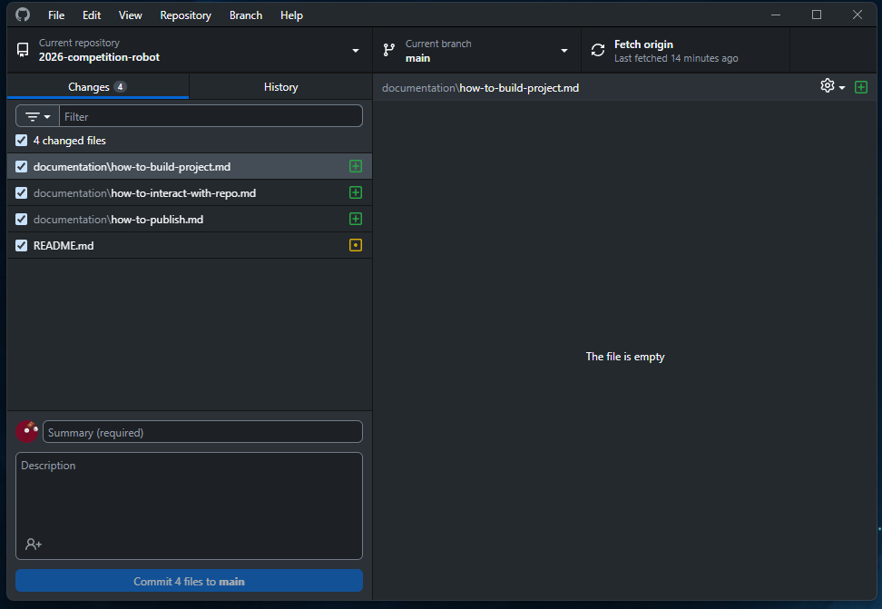
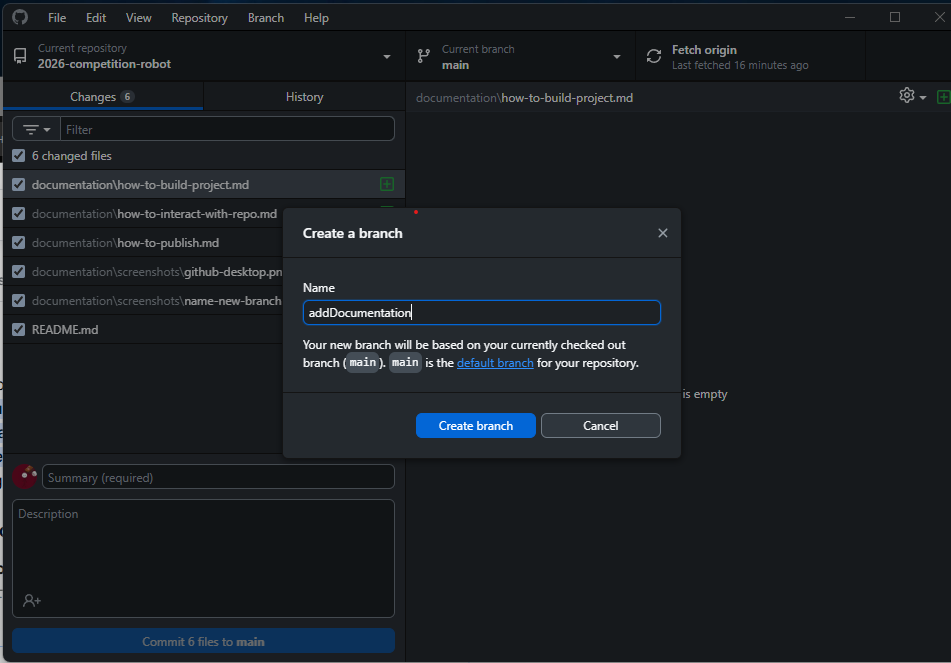

# Description
This page documents how to use github desktop with this repo and the expected flow.

# Instructions

1. Open github desktop  
 
2. Create a new branch for what you are working on.  
    a. click the current branch button at the top and add new branch
    
    b. name the new branch something relevant to what you are doing
    
    c. make changes
3. After making changes on your new branch commit them
    a. select the files you changed  that you want to commit in the changes window and add a relevant commit message in the summary for what changes you made.
    
    b. verify your commited changes are what you want by going to the history tab and checking the commit you just made.
    ~[verify](./screenshots/verify-commit.png)
