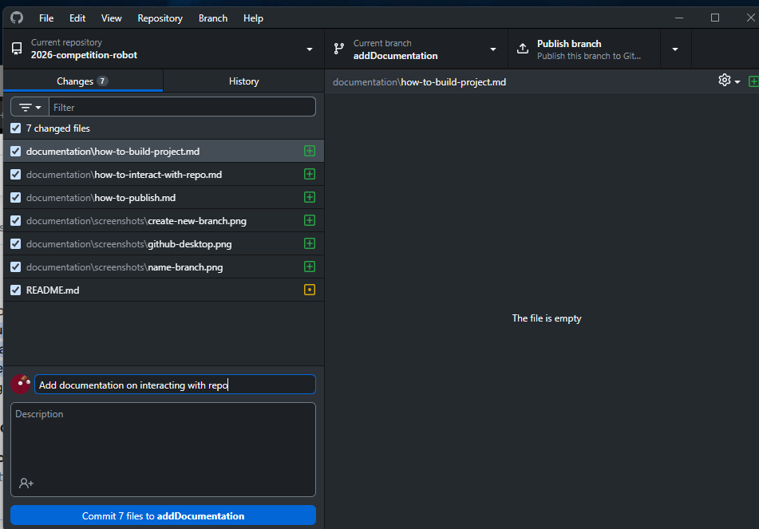
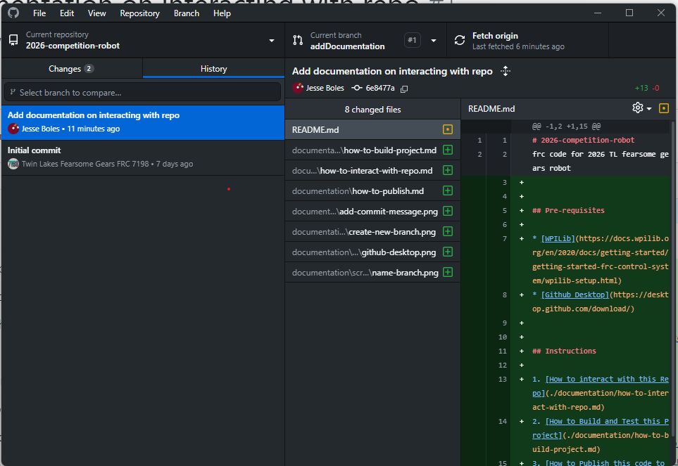
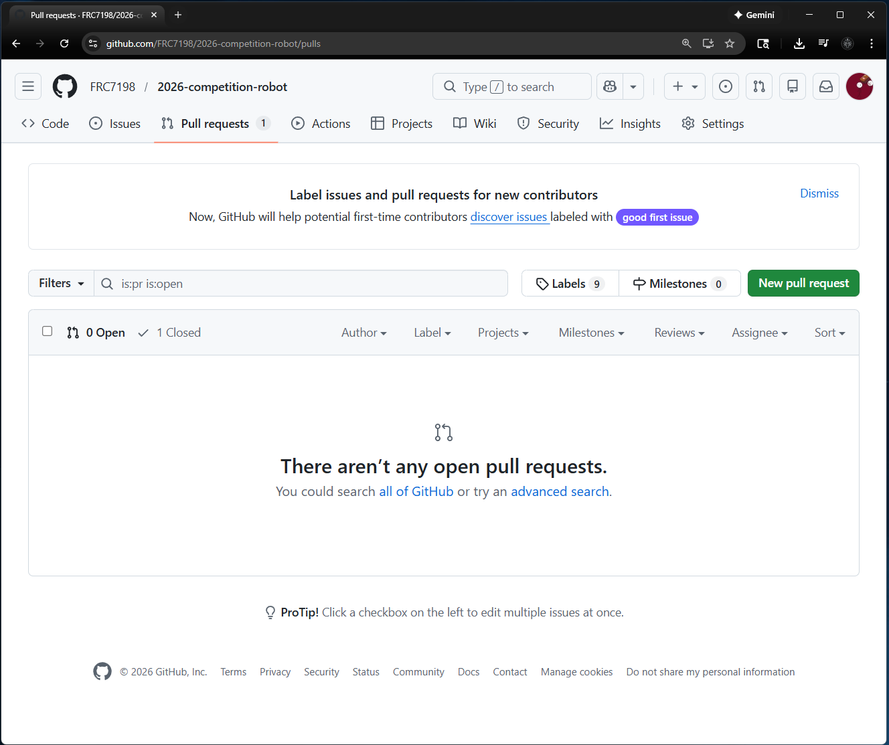
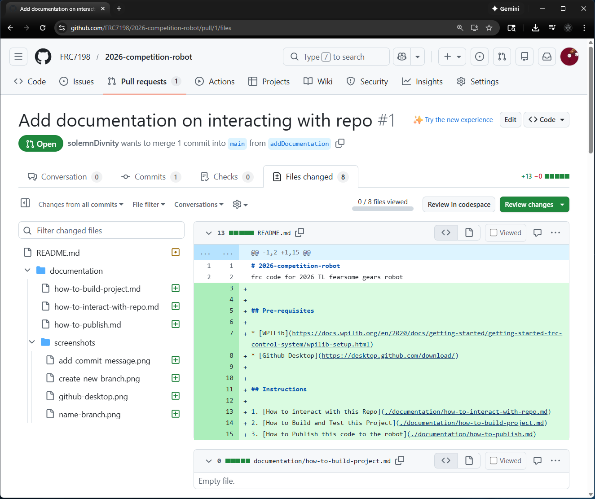
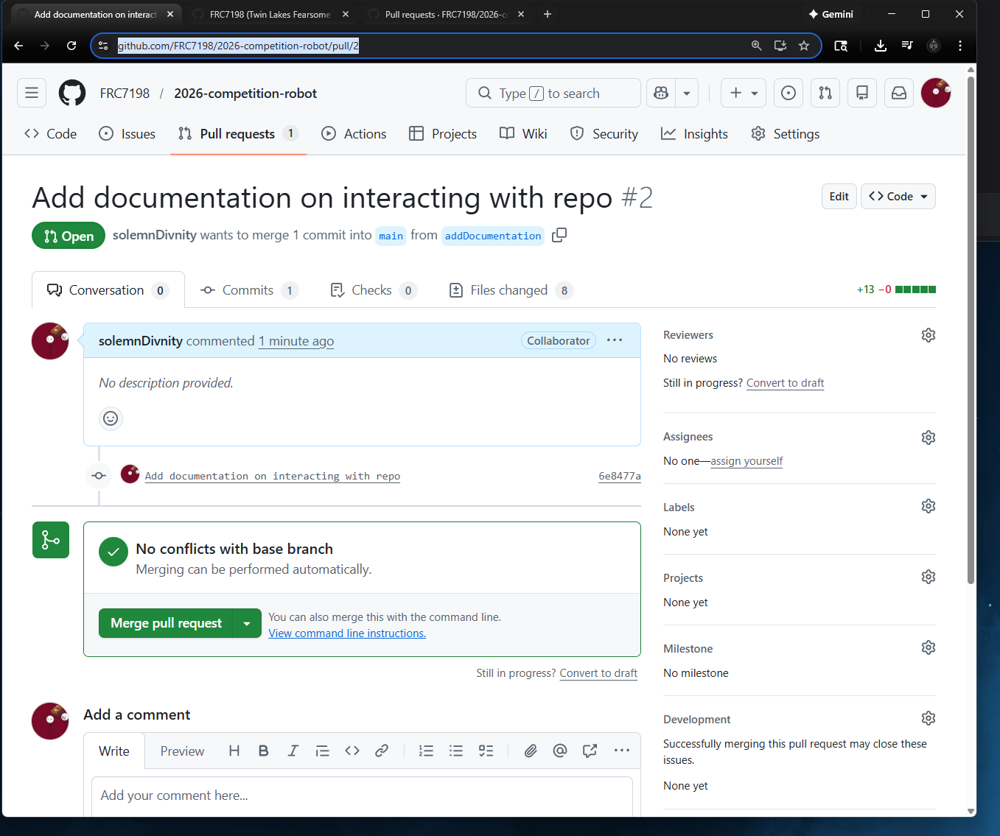

# Description
This page documents how to use github desktop with this repo and the expected flow.

# Instructions

1. Open github desktop  
 
2. Create a new branch for what you are working on.  
    a. click the current branch button at the top and add new branch
    
    b. name the new branch something relevant to what you are doing
    
    c. make changes
3. After making changes on your new branch commit them
    a. select the files you changed  that you want to commit in the changes window and add a relevant commit message in the summary for what changes you made.
    
    b. verify your commited changes are what you want by going to the history tab and checking the commit you just made.
    
    c. click the Push origin button to move your changes from just your machine to the github server.
4. Create a pull request with your changes.
    a.go to the [repo url](https://github.com/FRC7198/2026-competition-robot)
    b. click the pull requests tab
    
    c. click the new pull request button
    d. select branch you want to go FROM on the right and the branch you are going TO on the left. For this usually you are going from the branch you created earlier to main/master
    e. add a title and description of what changes are in this pull reqeust
    f. click the create pull reqeust button.
    
    g. verify the files you want to merge into the main codeline have the changes you expect. If not repeat step 3 above.
    
5. Get your PR reviewed.
    a. grab the pull request link from the browser url window.
    
    b. paste into our programming channel on the team discord and ask someone for a review.
6. review PR
    a. open the link the for review and go to the files tab. 
    b. Look for spelling and syntax errors or anything else relevant for the review.
    c. pull it locally to your machine and make sure it builds and that the tests pass.
    d. discuss in programming channel if changes need to be made or add comments to the PR and let the poster know. 
    e. once everything lookds good click the merge pull request button to merge into mainline code.
7. update local project with the latest code. 

